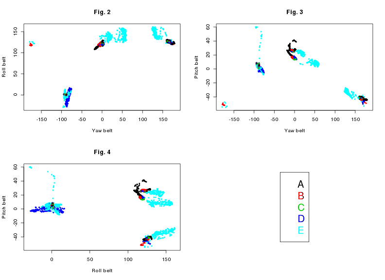

Activity Quality Prediction
========================================================
## Introduction
Nowadays it is possible to collect a large amount of data about personal activity using devices such as Jawbone Up, Nike FuelBand, and Fitbit. These devices are popular among enthusiasts like sportsmen, scientists and of cause tech geeks. In this project we will use data collected from accelerometers on the belt, forearm, arm, and dumbell of 6 participants to predict activity quality. 

## Methods
### Data Collection
According to [this paper](http://groupware.les.inf.puc-rio.br/har) six young health participants were asked to perform one set of 10 repetitions of the Unilateral Dumbbell Biceps Curl in five different fashions: exactly according to the specification (Class A), throwing the elbows to the front (Class B), lifting the dumbbell only halfway (Class C), lowering the dumbbell only halfway (Class D) and throwing the hips to the front (Class E). The data were recorded from accelerometers. We downloaded [train](https://d396qusza40orc.cloudfront.net/predmachlearn/pml-training.csv) and [test](https://d396qusza40orc.cloudfront.net/predmachlearn/pml-testing.csv) datasets on the 2nd of June, 2014.

```r
library(caret, quietly = T)
setwd("~/Doc/Coursera/PractML/proj")
data <- read.csv("train.csv", na.strings = "NA", header = T)
data <- data[sample(nrow(data)), ]
inTrain <- createDataPartition(data$X, p = 0.7)[[1]]
train <- data[inTrain, ]
valid <- data[-inTrain, ]
test <- read.csv("test.csv", na.strings = "NA", header = T)
```


### Exploratory Analysis
Exploratory analysis was performed by examining tables of the observed data. Having observed them, we identified transformations to perform on the raw data. Exploratory analysis was used to

1.  Verify the quality of the data
2.  Identify missing values
3.  Determine the terms to be used in the predictive model. 

We found that the train set contained 1287472 missing values, the test set had 2000 missing values. As the number of NA's in columns was relativly big we deleted those columns. Also we deleted the columns with service information such as "X", "cvtd_timestamp", etc.

```r
idx2remove <- function(df) {
    idx <- c()
    for (i in 1:dim(df)[2]) {
        if (sum(is.na(df[, i]))/dim(df)[1] > 0.1) 
            idx <- c(idx, i)
    }
    return(idx)
}
col.to.remove <- unique(c(idx2remove(train), idx2remove(valid), idx2remove(test)))

trainC <- train$classe
train <- train[, -c(col.to.remove)]

validC <- valid$classe
valid <- valid[, -c(col.to.remove)]

testC <- test$problem_id
test <- test[, -c(col.to.remove)]

train <- train[, sapply(train, is.numeric)]
valid <- valid[, sapply(valid, is.numeric)]
test <- test[, sapply(test, is.numeric)]
```


### Confounders
We identified variables with correlation over 0.9. This step allowed us to remove 3 additional columns from the each data set. 

```r
num.idx <- which(sapply(train, class) == "numeric")
descrCorr <- abs(cor(train[, num.idx]))
highCorr <- findCorrelation(descrCorr, 0.9)
highCorrCol <- dimnames(descrCorr[, highCorr])[[2]]
train <- train[, !names(train) %in% c(highCorrCol, "X", "cvtd_timestamp", "raw_timestamp_part_1", 
    "raw_timestamp_part_2", "num_window", "classe")]
valid <- valid[, !names(valid) %in% c(highCorrCol, "X", "cvtd_timestamp", "raw_timestamp_part_1", 
    "raw_timestamp_part_2", "num_window", "classe")]
test <- test[, !names(test) %in% c(highCorrCol, "X", "cvtd_timestamp", "raw_timestamp_part_1", 
    "raw_timestamp_part_2", "num_window", "problem_id")]
train <- sapply(train, as.numeric)
valid <- sapply(valid, as.numeric)
test <- as.matrix(sapply(test, as.numeric))
```


### Statistical Modeling
A simple linear or logistic regression is not a proper choice for building a predictive model with high-dimensional input data. We chose Random Forest from the __randomForest__ package. [“It runs efficiently on large data bases and can handle thousands of input variables without variable deletion. It gives estimates of what variables are important in the classification. It has methods for balancing error in class population unbalanced data sets”][rf1]. As stated by the
authors, the Random forest does not overfit. We built the model for the outcome variable *classe* using 49 predictive variables. 

```r
library(randomForest, quietly = T)
```

```
## randomForest 4.6-7
## Type rfNews() to see new features/changes/bug fixes.
```

```r
fitRF <- randomForest(x = train, y = trainC, importance = T, ntree = 317)
```

Here we can see 5 the most important variables

```r
varImpPlot(fitRF, n.var = 5, type = 1, main = "Fig. 1. Variable Importance")
```

 

With number of trees of 317 the Random Forest was successfully trained and the estimated OOB error rate (in sample error) for the training set was 0.52%. We don't need to do cross-validation as random forest uses bootstrap samples from the train set.

### Results
On the fig. 1 we can see the most important variables for the predicting model. 

Variable  | Mean Decrease in Accuracy
----------| -------------
yaw_belt          | 51.94487
roll_belt         | 47.18061
magnet_dumbbell_z | 41.88002

Let's plot these three variables. On the figures 2-4 we can see the relationship between those variables. We color grouped the points based on the 5 levels of activities quality. The figures show rather complicated patterns which cannot be linearly separated, thus, we used random forest.


```r
par(mfrow = c(2, 2))
valid <- data.frame(valid)
plot(valid$yaw_belt, valid$roll_belt, xlab = "Yaw belt", ylab = "Roll belt", 
    main = "Fig. 2", col = as.numeric(validC), pch = 19, cex = 0.5)

plot(valid$yaw_belt, valid$magnet_dumbbell_z, xlab = "Yaw belt", ylab = "Magnet dumbbell for z axis", 
    main = "Fig. 3", col = as.numeric(validC), pch = 19, cex = 0.5)

plot(valid$roll_belt, valid$magnet_dumbbell_z, xlab = "Roll belt", ylab = "Magnet dumbbell for z axis", 
    main = "Fig. 4", col = as.numeric(validC), pch = 19, cex = 0.5)
plot.new()
legend("center", legend = levels(validC), cex = 2, text.col = seq_along(levels(validC)))
```

 

We tested out model on validation set and observed a confusion matrix for the validation set.

```r
predRF <- predict(fitRF, valid)
confusionMatrix(predRF, validC)
```

```
## Confusion Matrix and Statistics
## 
##           Reference
## Prediction    A    B    C    D    E
##          A 1658   11    0    0    0
##          B    0 1135    5    0    0
##          C    2    4 1007   18    1
##          D    0    0    0  942    7
##          E    0    0    0    1 1093
## 
## Overall Statistics
##                                         
##                Accuracy : 0.992         
##                  95% CI : (0.989, 0.994)
##     No Information Rate : 0.282         
##     P-Value [Acc > NIR] : <2e-16        
##                                         
##                   Kappa : 0.989         
##  Mcnemar's Test P-Value : NA            
## 
## Statistics by Class:
## 
##                      Class: A Class: B Class: C Class: D Class: E
## Sensitivity             0.999    0.987    0.995    0.980    0.993
## Specificity             0.997    0.999    0.995    0.999    1.000
## Pos Pred Value          0.993    0.996    0.976    0.993    0.999
## Neg Pred Value          1.000    0.997    0.999    0.996    0.998
## Prevalence              0.282    0.195    0.172    0.163    0.187
## Detection Rate          0.282    0.193    0.171    0.160    0.186
## Detection Prevalence    0.284    0.194    0.175    0.161    0.186
## Balanced Accuracy       0.998    0.993    0.995    0.989    0.996
```

Out of sample error is about 0.8%. Finally we tested our model on the 20 test cases available in the test data. We got 100% prediction accuracy.

```r
predRFT <- predict(fitRF, test)
answer <- as.character(predRFT)
pml_write_files <- function(x) {
    n <- length(x)
    for (i in 1:n) {
        filename <- paste0("problem_id_", i, ".txt")
        write.table(x[i], file <- filename, quote = FALSE, row.names = FALSE, 
            col.names = FALSE)
    }
}
pml_write_files(answer)
```


### Conclusions
In this paper we proposed a predictive model based on Random Forest. This model provides high accuracy in identifying of activity quality. Also it reveals the most important variables for prediction.
Some potential problems should be noted. As it's stated by the author, Random Forest does not need “cross-validation or a separate test set to get an unbiased estimate of the test set error” but that's true only for independent and identically-distributed data. Also we should mention that the measure of importance of variables can be biased. Thus, variable importance can be overestimated.

[rf1]: http://www.stat.berkeley.edu/~breiman/RandomForests/cc_home.htm "Random Forests""
